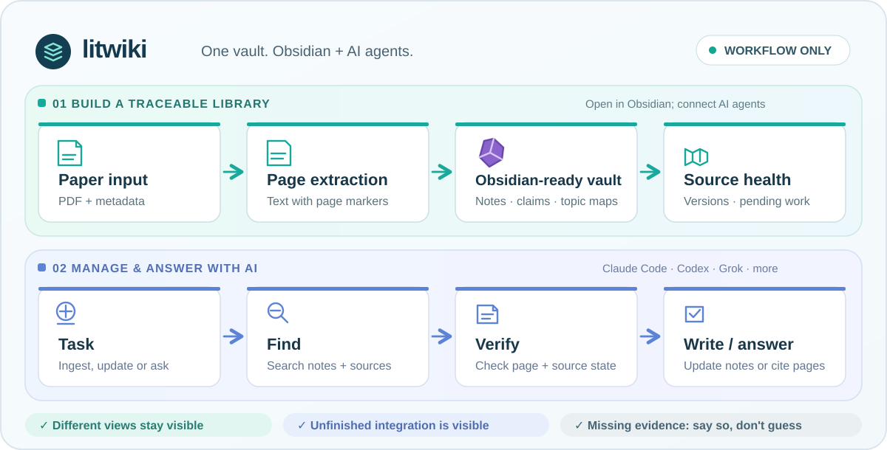

# litwiki

[](docs/overview.svg)

A literature knowledge base that an AI can actually be held to.

One paper = one note. Every fact carries a page citation. If the vault
does not contain the answer, the reply is exactly `Not in knowledge base.`
— never filled from training memory.

This repository is the **workflow**: schemas, prompts, scripts, and an
empty vault. It ships no papers. You clone it, point it at your own PDFs,
and fill it.

Open the plain-Markdown vault in **Obsidian** to browse and edit linked notes.
To use AI for ingestion, upkeep, or questions, start **Claude Code, Codex,
Grok, or another file-capable agent** in the vault and follow
[AI-GUIDE](meta/AI-GUIDE.md) and [WORKFLOW](meta/WORKFLOW.md). They use the
same notes, page citations, source checks, and validation rules; Obsidian
and any particular AI are optional.

---

## Install

```bash
git clone https://github.com/minjunnzheng/litwiki.git
cd litwiki
python3 -B scripts/validate.py          # 0 notes, 0 errors; unused tags are expected
python3 -B scripts/demo.py              # synthetic end-to-end example, no model needed
```

Needs: Python 3.10+, `pdftotext` (poppler) for PDF extraction, and optionally
Zotero + Better BibTeX. Claude Code / Codex / Grok all work: root a session
in this directory and `CLAUDE.md` / `AGENTS.md` load the answering protocol.

To invoke the skill from other projects:

```bash
cp -R skills/litwiki ~/.claude/skills/     # Claude Code
cp -R skills/litwiki ~/.codex/skills/      # Codex (real files, not a file-symlink)
cp -R skills/litwiki ~/.agents/skills/     # Grok / Agent Skills
export LITWIKI_ROOT="$PWD"                 # add to ~/.zshrc
```

Put `LITWIKI_ROOT` on PATH-adjacent config so a session started elsewhere
still finds the vault.

## First paper

1. Edit `meta/INSTRUCTIONS.md` — who the vault is for, which topics to extract densely.
2. Edit `meta/VOCAB.md` — the starter vocabulary is orogeny / thermochronology; replace it if your field is different. Notes may only use tags listed there.
3. Drop the PDF into Zotero (or any folder) and record the citekey.
4. From the vault root:

```bash
# if you use Zotero + Better BibTeX auto-export to meta/library.bib:
python3 scripts/zotero_map.py --citekey <citekey>
bash scripts/extract_fulltext.sh <citekey>

# Ask the current session: 依照 meta/EXTRACTION-PROMPT.md 消化 <citekey>
# Select an external runner only if you explicitly delegate this task.
# See WORKFLOW §A-4.
```

5. INTEGRATE the new paper into `_catalog.md`, `concepts/`, `mocs/`, and
   backlinks — WORKFLOW §A-5. Multi-file writes go through
   `scripts/transaction.py` (preview, then apply). See `meta/TRANSACTIONS.md`.
6. Record the source version and integration checks per `meta/QUALITY.md`.
   `digested` is not `integrated`. Run `health.py status` and `validate.py`.

## Source drift, pending integration and content checks

```bash
python3 -B scripts/health.py status
python3 -B scripts/health.py baseline --output /path/outside/vault/source-versions.json
```

[QUALITY.md](meta/QUALITY.md) defines source snapshots, completion receipts and
routine content checks. Verify the source passages, values, units, conditions
and locations used in a note or real answer. The first snapshot records today's
files, not an old digest's provenance. Legacy integration without receipts is
`unrecorded`; known unfinished integration stays `pending`.

Ordinary ingestion and use require no fixed question set, one-question-per-paper
exercise or human answer scoring. Saved QA is an optional cache for real queries.
Tool evaluation is optional and runs only when explicitly requested; see QUALITY
for `eval_human.py`. Ungraded case drafts are not integration debt. If human
scoring is requested, actual human approval is still required before reporting
human-grounded scores; literal checks remain separate from semantic grading.

[The synthetic example](examples/demo/README.md) runs in temporary storage.
[Upgrade and release instructions](docs/upgrading.md) explain private copies,
common rule updates and the public-file allowlist. Version: v0.1.0 candidate.

## What is in here

| Path | Role |
|---|---|
| `meta/AI-GUIDE.md` | Answering protocol. The AI reads this, then answers. Single source of truth. |
| `meta/SCHEMA.md` + `meta/templates/` | Note types: lit, claim, concept, moc, qa |
| `meta/VOCAB.md` | Controlled tags. Rewrite for your field. |
| `meta/INSTRUCTIONS.md` | Owner's priorities. You own this file; the AI may only propose diffs. |
| `meta/EXTRACTION-PROMPT.md` | The digest prompt. Quality is held here, not by the model. |
| `meta/AGENT-TASK.md` | Hand-off kit for an external CLI agent |
| `meta/WORKFLOW.md` | Day-to-day SOP: ingest, qa cache, Zotero, lint |
| `meta/TRANSACTIONS.md` | Preview / apply / rollback for multi-file writes |
| `meta/LINT.md` | Periodic semantic health check (diagnoses only) |
| `scripts/validate.py` | Schema, broken links, page anchors, catalog sync |
| `scripts/search.py` | Curated BM25 and opt-in original-page search (`--kind fulltext`) |
| `scripts/health.py` | Source/PDF hashes and integration queue |
| `scripts/eval_human.py` | Optional, explicitly requested human-scored tool evaluation |
| `scripts/eval_retrieval.py` | Legacy QA retrieval regression; AI labels remain AI labels |
| `scripts/transaction.py` | Atomic multi-file apply + crash recovery |
| `scripts/extract_fulltext.sh` | PDF → `fulltext/<citekey>.txt` with `[[p.N]]` markers |
| `scripts/zotero_map.py` | Citekey ↔ PDF ↔ metadata from Zotero |
| `scripts/bibcheck` | DOI resolve + title compare before a bibliography enters anything you trust |
| `skills/litwiki/` | Thin launcher: read AI-GUIDE, then route |

Empty on purpose: `lit/`, `claims/`, `concepts/`, `qa/`, `data/`, `mocs/`, `fulltext/`.

## Which tool does what

- **Ask a question** — follow `meta/AI-GUIDE.md`. Route: qa → claims → lit → fulltext.
- **Add a paper** — WORKFLOW §A. Do not let the model "just read it".
- **Several files at once** — `transaction.py`, never a pile of unreviewed edits.
- **Bibliography from an AI** — `scripts/bibcheck` first. A batch of fabricated references has made it into a real library before.

## Output language

Notes are bilingual by design: 中文 TL;DR, English technical content, English
citekeys and tags. The answering AI replies in the language you asked in.
Keep technical terms in English unless `INSTRUCTIONS.md` says otherwise.

## Customise

The highest-leverage edits after cloning:

1. **`meta/INSTRUCTIONS.md`** — focus topics and "always extract these".
2. **`meta/VOCAB.md`** — your field's tags. Validate will reject any tag not listed.
3. **`meta/EXTRACTION-PROMPT.md`** — only if the digest shape is wrong for your field; the rest of the charter (verbatim numbers, page anchors, no invented terms) should stay.

## Privacy

This workflow package contains **no papers**; teaching examples are synthetic. Once you ingest PDFs, `fulltext/` is
extracted copyrighted text. Keep *your* clone private. Do not open a PR that
adds `fulltext/` or `lit/` notes.

## Known limits

- `scripts/*.sh` are bash; `pdftotext` is required for extraction.
- The install examples copy a skill directory. Check your agent’s current discovery rules if using symlinks.
- `validate.py` warnings (unused VOCAB tags, empty vault) are expected on a fresh clone. Errors are not.
- A glossary of translations, if you keep one, is yours to point at from `INSTRUCTIONS.md`. This package does not ship one.

## License

MIT for the workflow (schemas, prompts, scripts). Papers you add remain
copyright of their publishers.
